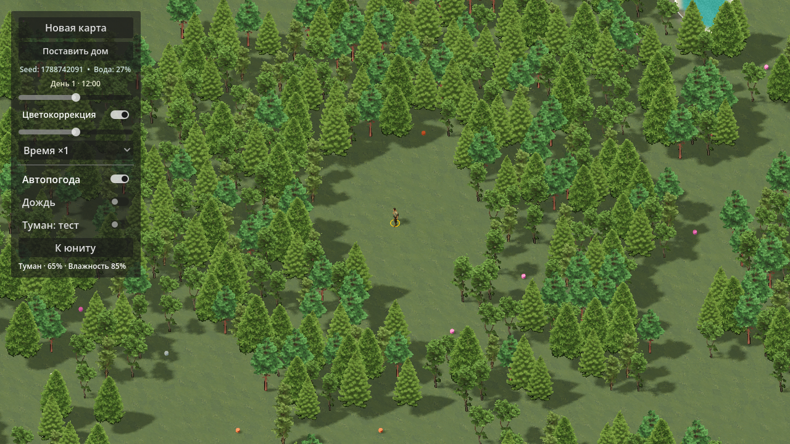
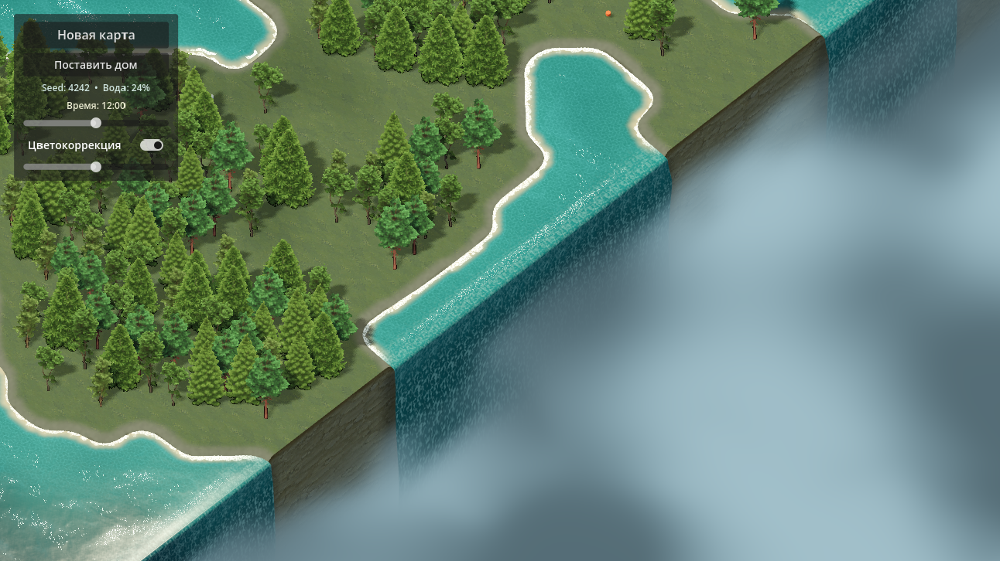
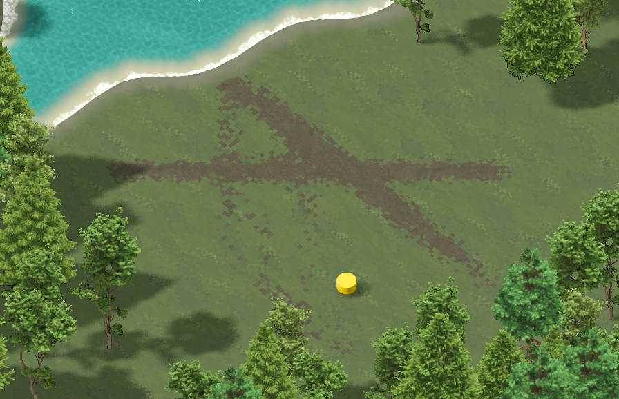

# RTS Perlin Prototype

Изометрический 3D-прототип RTS на **Godot 4.7.2**: процедурный мир,
пиксельные текстуры и спрайтовые деревья в сочетании с освещением и 3D-юнитами.

## Скриншоты

Вода, водопады на краях мира и переход в туман:

Протаптываемые дорожки — одобренный результат теста до замены жёлтого маркера
на модель крестьянина:

**[Вся галерея: 7 скриншотов с пояснениями](docs/screenshots/README.md)** —
включая утренний туман, ночной дождь и первого 3D-юнита.

## Текущее состояние

- Процедурная суша, водоёмы, берег и смешанные лесные массивы.
- Анимированная вода, стилизованный обрыв карты и водопады, уходящие в туман.
- День/ночь, тени, автоматическая погода, дождь и туман с видимостью вокруг юнита.
- Дорожки, постепенно проявляющиеся от повторных проходов.
- Один крестьянин Quaternius: ожидание, бег, повороты и кольцо у ног.
- Передвижение по суше с поиском пути; временное размещение дома.
- Режим «игрок-хост»: подключение по IP, общий мир/время/погода и видимый юнит
  каждого подключённого игрока.

## Запуск и текущее управление

Открыть `project.godot` в Godot 4.7.2 и запустить главную сцену (`F6` для
открытой main.tscn либо `F5` для проекта). Рендерер — Forward+.

- Камера: WASD или перетаскивание зажатой средней кнопкой мыши; колесо — масштаб.
- ЛКМ по суше: переместить текущего юнита. ПКМ: отменить маршрут/размещение дома.
- «К юниту»: центрировать камеру. Погода и время доступны в тестовом интерфейсе.

Полноценное RTS-выделение, группы и очередь приказов пока **не реализованы** —
это следующий этап. Добычи, боя и экономики ещё нет.

Сетевой прототип показывает подключённых игроков отдельными юнитами. Их движение
и приказы будут подключены после замены тестового управления. Подробнее:
[NETWORK_NOTES.md](NETWORK_NOTES.md).

## Документация

- [Инструкция для продолжения](NEXT_SESSION.md)
- [Первый юнит и лицензии ресурсов](assets/units/worker/README.md)
- [Сеть](NETWORK_NOTES.md), [погода](WEATHER_NOTES.md), [дорожки](TRAILS_NOTES.md), [тени](TREE_SHADOW_NOTES.md)

Скриншоты — реальные кадры прототипа на разных этапах разработки, не концепт-арт.
Папка галереи исключена из импорта Godot и не используется игрой.
