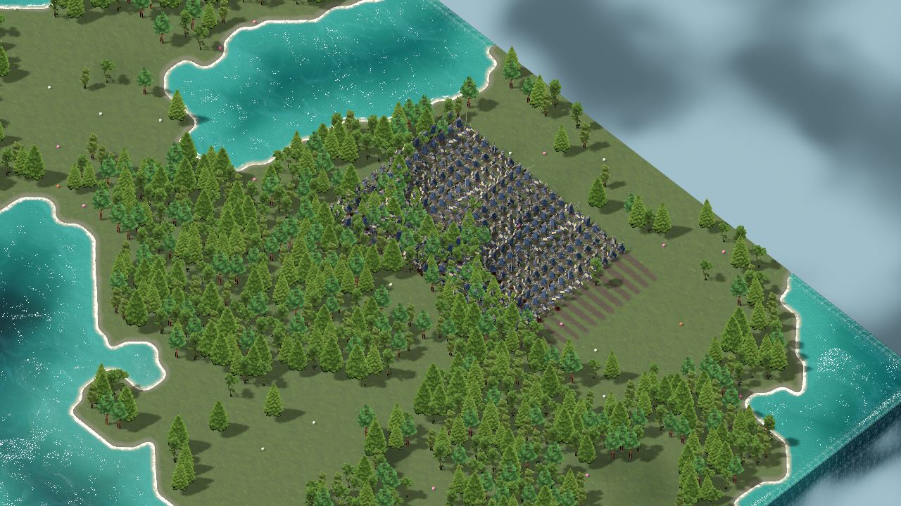

# Animation LOD и бюджет крови — 9 сентября 2026

## Что изменилось

Оптимизированы отображение анимаций и создание крови. Меши/материалы рыцарей,
шейдер пиксельной крови, карта, вода, освещение и UI не переделывались.
Приказы, скорость перемещения, root motion Combo, урон и условия смерти сохранены.

`worker_visual.gd` управляет AnimationPlayer вручную. Крупный экранный размер
(проекция вертикального отрезка 1.4 >=80 px) — поза каждый кадр; 40–80 px — 30 Гц;
меньше 40 px — 20 Гц. Корень юнита и его поворот продолжают двигаться каждый кадр.
Это намеренное снижение временной детализации маленьких моделей: при внимательном
наблюдении его можно заметить, поэтому полная частота сохранена для крупного плана.
Частоты не означают, что сама игра ограничена 20/30 FPS.

Вне кадра с запасом max(256 px, 40% высоты экрана) визуальная поза приостанавливается,
а время клипа накапливается с учётом speed_scale. При возвращении — один advance
на актуальное время, без цикла пересчёта всех пропущенных кадров. Смена клипа/сброс
отбрасывают время предыдущего действия. Есть консервативная проверка длинной тени
от KeyLight: внеэкранный источник видимой тени продолжает анимироваться.

Игровые узлы не отключаются. Смерть теперь использует отдельный таймер, как уже
делали атаки/Combo. Перед редким попаданием вызывается актуализация позы для
позиции крови. AnimationPlayer completion не управляет игровым уроном.
`animation_lod_enabled=false` — диагностическое сравнение с полной частотой.

Кровь:

- Вместо синхронной растеризации всех новых пятен — очередь до 512 работ.
- Бюджет растеризации ~1,5 мс/кадр с проверкой каждые 8 пикселей. Это не жёсткий
  предел всего `_process`: объединение и загрузка текстуры учитываются отдельно.
- При >48 ожидающих работ близкие контакты могут объединяться визуально;
  при полном лимите косметический эффект может быть отклонён. Урон не зависит
  от принятия эффекта. Диагностические счётчики не скрывают это.
- Вместо словаря с полным сбросом на 65536 элементов — фиксированный byte-кэш
  1024² (1 МиБ). Для внутренних сухих клеток — консервативный кэш окружения 7×7.
  Он допустим для малых отпечатков из-за ограниченной области B-spline/warp
  в текущем рендерере. У берега остаётся исходная проверка высоты/суши.
- Новая карта/сброс очищают очереди и кэши. Старение отсчитывается от контакта,
  не от момента завершения отложенной растеризации.
- `flush()` без аргументов синхронный только для тестов/снимков. Runtime вызывает
  бюджетный обработчик и `flush(false)`.

## Сравнение на прежнем стенде

Тот же Ryzen 5 5600 / RX 6600 / 32 ГиБ, Godot 4.7.2 debug Forward+, 1280×720,
без VSync, seed 1788918610, ясный полдень, camera size 42, все центры в кадре.
По 2 секунды прогрева + 8 секунд измерений. Основной сценарий не изменён.
Сравнение с исходным коммитом `54388e8`, данные сохранены предыдущим `8f8b199`.

| Юнитов | Покой до → после, FPS | Движение до → после, FPS | Атаки+кровь до → после, FPS |
|---:|---:|---:|---:|
| 50 | 105,7 → 107,9 | 106,2 → 107,6 | 105,1 → 108,1 |
| 100 | 106,1 → 101,4 | 103,6 → 100,3 | 94,8 → 100,7 |
| 150 | 95,0 → 101,5 | 76,5 → 96,1 | 66,0 → 97,7 |
| 200 | 70,9 → 99,5 | 56,8 → 80,2 | 51,4 → 91,4 |
| 250 | 56,2 → 91,7 | 46,3 → 57,1 | 40,7 → 80,8 |
| 300 | 47,7 → 66,8 | 37,6 → 49,7 | 28,0 → 52,7 |

На 300 движение: P95 31,1 → 25,3 мс. Атаки+кровь: P95 53,1 → 26,6 мс,
самый длинный кадр 317,2 → 36,8 мс. `spawn_hit` в среднем 9,41 → 0,16 мс/кадр;
часть работы теперь перенесена в `_process` крови: 1,94 → 2,56 мс/кадр.
Нельзя сравнивать только подешевевший spawn_hit, игнорируя отложенную работу.
Повторная контрольная фаза динамической крови дала 51,1 FPS. Рабочая память
процесса в основном сценарии 300 атакующих ~598 МиБ, private bytes ~1061 МиБ.

В фазах основной матрицы coalesced=0 и rejected=0: прирост не получен скрытым
отбрасыванием попаданий. На конце фазы 300 оставалось 8 работ в очереди;
асинхронные пятна могут появляться с небольшой задержкой. Позы на дальнем плане
действительно обновлялись около 20 раз/с на юнита, а не были полностью выключены.

Это короткие последовательные окна, не многократное статистическое исследование.
На 50–100 ожидаемого большого прироста нет, есть разброс/накладные расходы
планирования. На 300 стабильные 60 FPS ещё не достигнуты. Бой здесь синтетический:
анимации + один контакт/юнита/2 с; полноценного AI, толкания толпы и сети нет.
Качество движения 20 Гц нужно дополнительно оценить пользователю в основном мире.

Во время GPU-прогона после загрузки кода добавлена только консервативная ветка
проверки внеэкранной тени. Она не выполняется в основной матрице со всеми центрами
в кадре; актуальный код отдельно проверен функциональными тестами.

## Проверки и ограничения

`animation_budget_test.gd`: одинаковые HP/число попаданий/итоговые позиции Combo/
смерть при видимом и невидимом бое; актуальная поза при возвращении камеры;
движение вне кадра; полная частота вблизи и 20 Гц вдали; равенство ускоренной
проверки суши исходной на выборке карты; объединение перегрузки и сброс очереди.
`knight_blood_test.gd`: прежние проверки попаданий/промахов/отмены, смерти,
пиксельного объединения, берегов, старения/очистки. Крупный кадр крови проверен.
Индивидуальные фазы походки проверены `knight_gait_phase_test.gd`.
На окончательном коде также прошли `knight_combo_motion_test.gd`,
`knight_training_test.gd`, `rts_controls_test.gd` и повторный
`animation_budget_test.gd` с проверкой длинной тени. Логи сохранены рядом с данными.

**Не исправлено попутно:** максимум 289 целей в групповом приказе, лимит хранения
96 готовых записей крови (в интенсивной битве старые вытесняются раньше высыхания),
массовое избегание соседей, полноценный боевой AI. Для длительной массовой битвы
нужен следующий этап: пространственное накопление крови и оптимизация приказов.
Не увеличивать лимит записей бесконтрольно: стоимость объединения вырастет.

Стенд и условия: [исходный отчёт](STRESS_TEST_2026-09-09.md).
Результаты: [JSON нового прогона](stress-opt20260909/stress-opt20260909-results.json),
OS-метрики и лог рядом. Для повтора:
`Godot --path . --script res://tests/unit_stress_test.gd --resolution 1280x720 --disable-vsync -- --out=<absolute-prefix>`.

