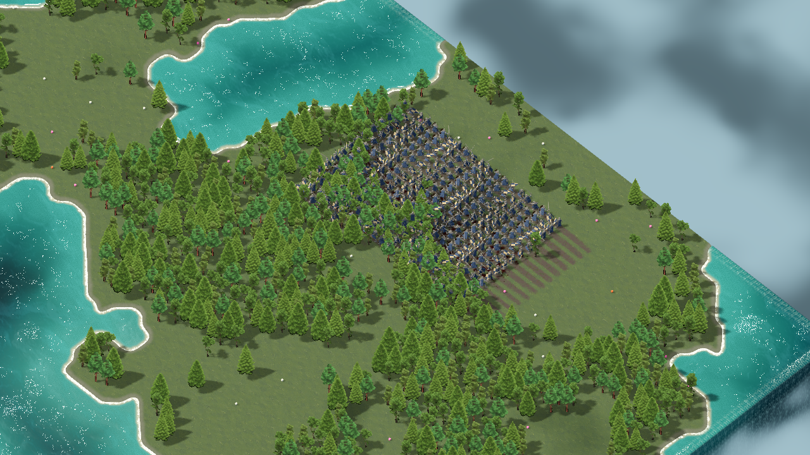

# Стресс-тест рыцарей — 9 сентября 2026

## Вывод

На текущем ПК 50–100 рыцарей проходят короткий нагрузочный тест хорошо. На 150
уже заметно ухудшаются тяжёлые кадры, на 200 движение ниже 60 FPS, на 300 —
около 38 FPS в движении и 28–33 FPS при интенсивном создании крови.
Это не готовность полноценного боя на 300: боевой AI и массовое избегание
столкновений ещё не реализованы и в эти числа не входят.

Главные подтверждённые проблемы: стоимость обработки анимаций, создание крови
на CPU и ограничения группового диспетчера. Нехватки памяти в этом прогоне нет.
Игровые скрипты, модели, визуал и настройки не изменены: добавлен только отдельный
стенд и сохранены результаты. Оптимизации и найденные ошибки пока НЕ исправлены.

## Условия и достоверность

- Исходная версия: `54388e8`, ветка `main`.
- Ryzen 5 5600, 6 ядер / 12 потоков; Radeon RX 6600; 32 ГиБ RAM.
- Windows, Godot 4.7.2 official debug, Forward+, MSAA setting 2 (4x).
- Реальный GPU-рендер, **не headless**. 1280×720, VSync выключен, FPS не ограничен.
- Реальный основной мир и blue knight с текущими анимациями/LOD/плащом.
  Seed `1788918610`, полдень, ясная погода, ортокамера size 42.
- Все центры тестовых юнитов в кадре; деревья могут частично закрывать модели.
  Старые пять юнитов и NPC скрыты и отключены, UI скрыт. Это небольшая постоянная
  добавка к памяти, не работающие дополнительные бойцы.
- На фазу: 2 секунды прогрева, затем 8 секунд измерений. Основная матрица — один
  последовательный прогон; контрольные фазы показывают вариативность. Это не
  многочасовой тест утечек и не статистически точный прогноз для любого ПК/seed.
- `idle`: обычные индивидуальные Idle-анимации. `move`: почти все движутся
  туда-обратно по настоящим заранее рассчитанным AStar-маршрутам; дорожки включены.
  Стоимость массовой выдачи нового приказа измерена отдельно.
- `attack_blood`: Attack_Combo с разными фазами, корни стоят на месте. Один
  синтетический контакт на юнита раз в 2 секунды вызывает настоящий `spawn_hit`.
  Для 300 это 150 контактов/с. Нет поиска противника, root motion, HP/смертей,
  сетевого обмена, полноценного боя или массовых коллизий. Не путать с PvP-тестом.
- Есть накладные расходы таймеров, обхода массива и Windows-счётчиков.
  Разброс фаз анимации/случайных пятен и прогрев кэша влияют на результаты.

FPS рассчитан по фактическому времени кадров, не по редкому счётчику интерфейса.
P95 — время, быстрее которого прошли 95% кадров; меньше лучше, бюджет 60 FPS —
16,67 мс. GPU ms — время рендера viewport, а render CPU ms не включает все
игровые скрипты: [описание измерителей Godot](https://docs.godotengine.org/en/stable/classes/class_renderingserver.html).
Эти времена нельзя просто сложить с FPS-временем из-за перекрытия CPU/GPU.
В исходных JSON поле `slow_1pct_fps` означает 1000/P99, **не среднее худшего 1%**;
в стенде оно переименовано в `p99_equivalent_fps` для следующих запусков.

## Основная матрица

| Юнитов | Покой, FPS | Движение, FPS | Атаки + кровь, FPS | P95 движения, мс | P95 атак, мс |
|---:|---:|---:|---:|---:|---:|
| 5, контроль | 109,8 | 111,5 | 107,0 | 10,4 | 9,9 |
| 50 | 105,7 | 106,2 | 105,1 | 10,8 | 10,8 |
| 100 | 106,1 | 103,6 | 94,8 | 12,2 | 15,4 |
| 150 | 95,0 | 76,5 | 66,0 | 17,3 | 22,5 |
| 200 | 70,9 | 56,8 | 51,4 | 20,6 | 26,5 |
| 250 | 56,2 | 46,3 | 40,7 | 25,1 | 36,3 |
| 300 | 47,7 | 37,6 | 28,0 | 31,1 | 53,1 |

На 300 в атакующей фазе P99 = 154 мс, самый длинный кадр = 317 мс.
Повторная фаза динамической крови: 33,0 FPS, P95 44 мс, максимум 201 мс.
То есть проблема не только в среднем FPS, но и в отдельных заметных зависаниях.

## Нагрузка и память

Средние Windows-счётчики процесса в фазах **атаки + кровь**:

| Юнитов | CPU от всех 12 потоков | GPU 3D процесса | Working set | Private bytes |
|---:|---:|---:|---:|---:|
| 50 | 5,1% | 80,7% | 545 МиБ | 1006 МиБ |
| 100 | 7,4% | 85,5% | 554 МиБ | 1016 МиБ |
| 150 | 8,0% | 63,5% | 564 МиБ | 1025 МиБ |
| 200 | 8,4% | 49,0% | 575 МиБ | 1037 МиБ |
| 250 | 8,2% | 39,2% | 586 МиБ | 1048 МиБ |
| 300 | 8,3% | 27,9% | 595 МиБ | 1058 МиБ |

8,3% суммарного CPU здесь примерно соответствует одному полностью занятому
логическому потоку. Это не доказательство закрепления за конкретным ядром, но
вместе с контрольными тестами указывает на CPU/последовательную обработку,
а не на «92% свободной мощности, значит процессор ни при чём».
GPU utilization — редкий процессный 3D-counter, не температура/потребление.
Working set и private bytes — разные показатели, складывать их нельзя.
На 300 движущихся GPU render time ~9,15 мс при общем кадре ~26,6 мс.
Godot учитывает около 390 МиБ render allocations; это не вся выделенная драйвером VRAM.
Температуры и долговременная стабильность не проверялись.

## Узкие места и контрольные выключения

### 1. Анимации — первый приоритет

На 300 стоящих: исходно 47,7 FPS; в отдельном прогоне 45,3 FPS.
**Выключение только AnimationPlayer.active при сохранении обычного unit._process
даёт 100,7 FPS**. Заморозка анимаций с блокировкой движения дала 99,2 FPS.
Это сильнее, чем эффект отключения теней (52,2 FPS) или плащей (54,5 FPS).

Текущий mesh LOD не является animation LOD: сотни экземпляров продолжают
обрабатывать скелетные/прочие анимационные треки. У плаща сохранён 81 morph target.
Измерение не разделяет отдельно цену костей, morph-треков и внутренних обновлений
рендера — для этого нужен следующий подробный профиль, а не предположение.

Следующее направление: частота обновлений дальних анимаций, пауза вне кадра,
аудит треков и корректный LOD анимации. Проверять плавность и силуэт. Нельзя просто
вернуть авто-LOD тела, который раньше ломал ноги, или удалить принятый плащ.

### 2. Кровь: дорого создавать, хранить рисунок дешевле

На 300 контакты `spawn_hit` занимают в среднем 6,26–9,41 мс на кадр в двух
прогонах; объединение/обновление поля в `_process` ещё 1,58–1,94 мс в среднем.
В основном прогоне отдельный пакет контактов занял 286 мс. Это измеренный участок
кода, не цена одного попадания. Частота обновления текстуры 10 Гц не ограничивает
затраты каждого синхронного `spawn_hit`.

Атаки без новых пятен — 37,1 FPS; с заранее созданным и не обновляемым полем —
45,1 FPS; с динамическими пятнами — 28–33 FPS. Разницу 37/45 нельзя объявлять
ускорением от крови: это последовательные окна анимации/кэша. При неизменном поле
нет дорогой генерации и обновлений, GPU около 9,3 мс в обоих случаях.

В `scripts/training_blood.gd` генератор обходит пиксели пятен, проверяет сушу и
высоту поверхности; кэш сухих пикселей целиком очищается при 65536 записях.
Это кандидат на источник пиков, но именно сброс кэша отдельным таймером не измерен.
Не нужно обвинять один лишь визуальный шум в шейдере.

Есть и масштабная логическая проблема: **CAPACITY = 96 записей на весь мир**.
При 150 успешных попаданиях/с старые записи вытесняются примерно за 0,64 секунды,
раньше срока высыхания 120+30 секунд. Бесконечно увеличивать лимит нельзя:
`flush` каждый раз заново объединяет все записи и загружает полное поле 1024².

Направление: накопление по участкам карты, объединение близких контактов,
ограниченный бюджет новых отпечатков на кадр, инкрементальные dirty-области и
предвычисленная маска суши. Сохранить пиксельный шум и отсутствие обводок.

### 3. Групповой приказ — подтверждённый функциональный дефект

Одна MOVE-команда на 300: поставлены в очередь 289, отклонены 11.
Причина в `scripts/rts_orders.gd`: `_free_destination` проверяет radius 0…8,
то есть максимум 17×17 = 289 клеток даже на сплошной суше.

Выдача приказа заняла 19,75 мс синхронно. Затем очередь опустела через 73 кадра /
1774 мс: лимит 4 пути на кадр защищает кадр, но задерживает старт хвоста отряда.
Это не означает, что один AStar-поиск занимает 1,77 секунды.

Нужно отдельно исправить вместимость распределения и затем тестировать бюджет
поиска путей/общие маршруты. Нет полноценного избегания других юнитов/деревьев;
его будущая стоимость в текущие FPS не входит.

### 4. Сама карта тоже тяжёлая, но не главный предел 300 юнитов

Инвентаризация мешей: Terrain 2 163 200 треугольников,
TerrainShadowReceiver ещё 2 163 200 (повторный проход того же меша),
Water 437 632. Уже на 5 юнитах счётчик рендера ~5,04 млн primitives/кадр;
на 300 ~7,77 млн и 3649 draw calls против 101 на 5. Primitives включают проходы,
это не число уникальных треугольников ассетов.

При 300 отключение воды снижает GPU время с ~9,8 до 6,1 мс, но FPS остаётся
~44–45. Render scale 0,5: GPU ~6,1 мс, FPS ~47,3 против 47,7 исходных.
Поэтому апскейлер сейчас не решит главную проблему большого отряда.
Отключение леса тоже не дало существенного выигрыша (48,4 FPS).

Для GPU-оптимизации позднее: чанки/culling, детализация земли преимущественно
у берегов, аудит второго прохода и воды. Не портить плавные берега и тени.

### Другие проверки

- 300 выбранных движущихся: 36,2 FPS против 39,2 без группового выделения;
  построение путей ~0,27 мс/кадр, входит в общее unit_ms, не добавлять дважды.
- Движение без протаптывания: 36,5 FPS — подтверждённого ускорения нет.
  Это не доказательство бесплатности дорожек на любой карте.
- Отключение world._process: 45,0 против 45,3 FPS — не основной предел.
- Покой с дождём 0,8 / туманом 0,65: 44,0 FPS против 45,3 ясных; проверено только
  одно состояние погоды и эта камера, не полный цикл суток.
- 1920×1080, 300 стоящих: 42,7 FPS, GPU 14,4 мс; возврат 1280×720 — 45,3 FPS.
  На слабой GPU/большем разрешении GPU может стать ограничителем раньше.

## Приоритет дальнейшей работы

1. Исправить 289-целевой предел и задержки групповых приказов.
2. Добавить качественный animation LOD; повторить тот же стенд.
3. Убрать пики создания крови и пересмотреть хранение под массовую битву.
4. После этого оптимизировать геометрию/рендер и проверять реальный бой,
   препятствия, 1080p/1440p, слабые ПК и длительные игровые сессии.

Это рекомендации, не уже выполненные исправления. Для нынешнего состояния
100 юнитов — подтверждённый хороший короткий сценарий на этом ПК, а не жёсткий
лимит игры и не гарантия будущей полноценной битвы на 100.

## Воспроизведение и исходные данные

Из корня проекта, подставить путь к установленному Godot. Не запускать параллельно
с другой игрой/GPU-тестом. Окно должно рендериться, не использовать `--headless`
для измерения FPS. Стенд сам завершает процесс после теста, основную сцену не меняет.

```powershell
$godotExe = 'C:/path/to/Godot_v4.7.2-stable_win64.exe'
$stressPrefix = Join-Path $env:TEMP 'rts-stress-20260909'
$stressProcess = Start-Process -FilePath $godotExe -WorkingDirectory (Get-Location).Path -WindowStyle Hidden -PassThru -ArgumentList @('--path','.', '--script','res://tests/unit_stress_test.gd', '--resolution','1280x720', '--disable-vsync', '--log-file',($stressPrefix + '.log'), '--',("--out=" + $stressPrefix))
./tests/stress_monitor.ps1 -TargetProcessId $stressProcess.Id -OutputPrefix $stressPrefix
```

Второй запуск с дополнительным аргументом `--extra` после `--` проверяет
однофакторные выключения, погоду и 1080p. Для его монитора OutputPrefix должен
быть `$stressPrefix + '-extra'`. В путях с пробелами правильно цитировать аргументы
Start-Process. Без `--out` результаты пишутся в Godot user_data проекта.

Стенд: `tests/unit_stress_test.gd`, `stress_world.gd`, `stress_unit.gd`;
Windows-метрики: `tests/stress_monitor.ps1`.
Оба полных GPU-запуска закончились `UNIT_STRESS_PASS` / `UNIT_STRESS_EXTRA_PASS`,
в логах нет SCRIPT ERROR. После изменения только параметров вывода стенд также
прошёл `--check-only` (это проверка синтаксиса, не повторный GPU-прогон).

Сохранены неизменённые [основные измерения](stress-20260909/stress-20260909-results.json),
[контрольные измерения](stress-20260909/stress-20260909-extra-results.json),
[результат группового приказа](stress-20260909/stress-20260909-dispatcher.json),
логи и OS JSONL в том же каталоге. В старом metadata общие условия записаны как
ясные 720p; исключения определяются именами extra-фаз и описаны выше.


