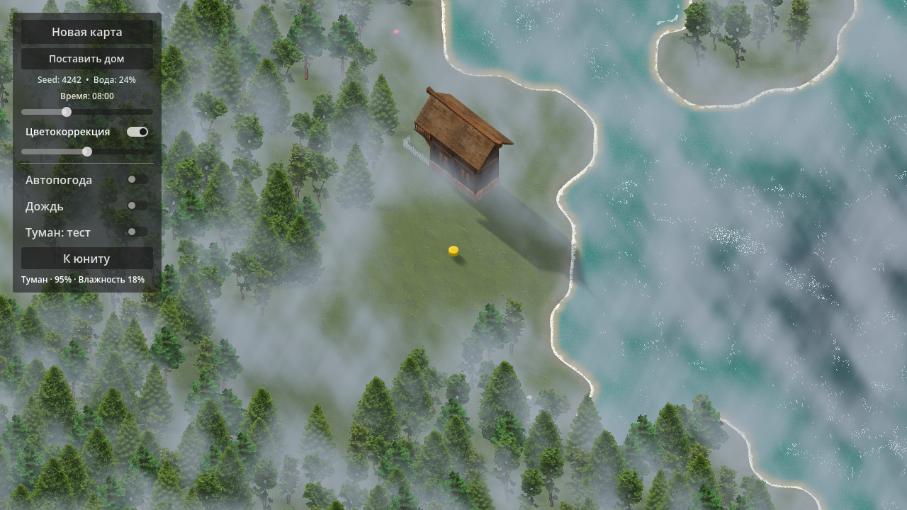
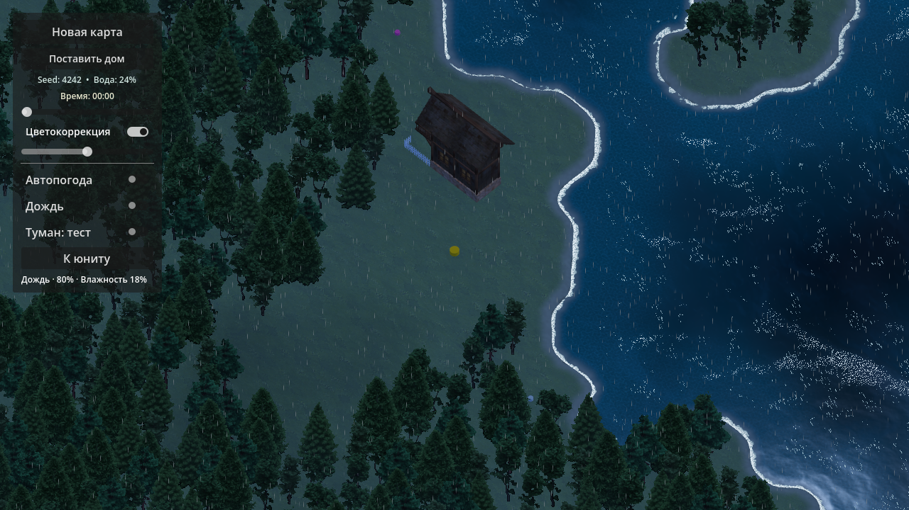
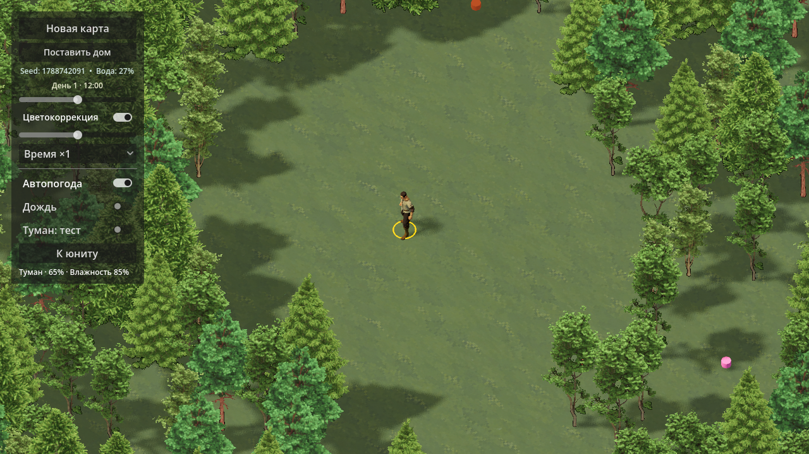
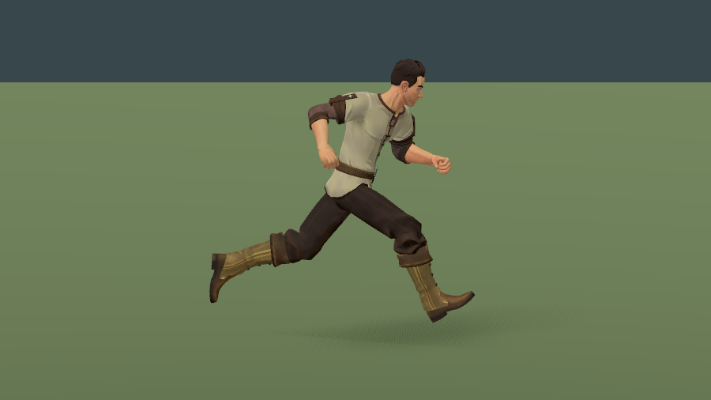

# Визуальная галерея

[На главную](../../README.md)

Семь реальных снимков нашего прототипа, собранных 7 сентября 2026 года.
PNG сохранены без изменения пикселей и без ретуши. Здесь нет чужих игровых
референсов. Кадры относятся к разным этапам: жёлтый цилиндр на ранних снимках
позже заменён на 3D-крестьянина, интерфейс и тени также развивались.

## Леса и общий масштаб

Основная сцена после подключения крестьянина, масштаб камеры 22.
Источник: `worker_game_22.png` из визуальной проверки.

## Вода, обрывы и водопады

Снимок этапа стилизации краёв мира: вода продолжается водопадом, обрыв
растворяется в тумане. Источник: `world_edge_4.png`.

## Утренний туман

Проверка погодного эффекта и области видимости вокруг тестового юнита.
Кадр до подключения 3D-модели. Источник: `weather_fog_morning.png`.

## Ночной дождь

Проверка дождя и ночного освещения до подключения 3D-модели.
Источник: `weather_rain_night.png`.

## Протаптываемые дорожки

Скриншот пользователя с одобренным результатом: повторные проходы проявляют
землю среди травы. Здесь ещё используется жёлтый тестовый маркер.
Источник: приложенный к сообщению «работает замечательно» PNG
`codex-clipboard-5c6d60bc-edba-4b3b-bcc3-e0dd58b22b28.png`.

## Первый крестьянин в игре

Модель Quaternius в основной сцене, масштаб камеры 9.
Источник: `worker_game_9.png`.

## Анимация крупным планом

Фаза бега на технической сцене проверки модели, не отдельная игровая локация.
Источник: `worker_jog_side.png`. Модель, голова и одежда используют общий скелет.

Это иллюстрации внешнего вида, а не замеры FPS или демонстрация законченной RTS.
Галерея содержит копии кадров; исходники не перемещались и не изменялись.
